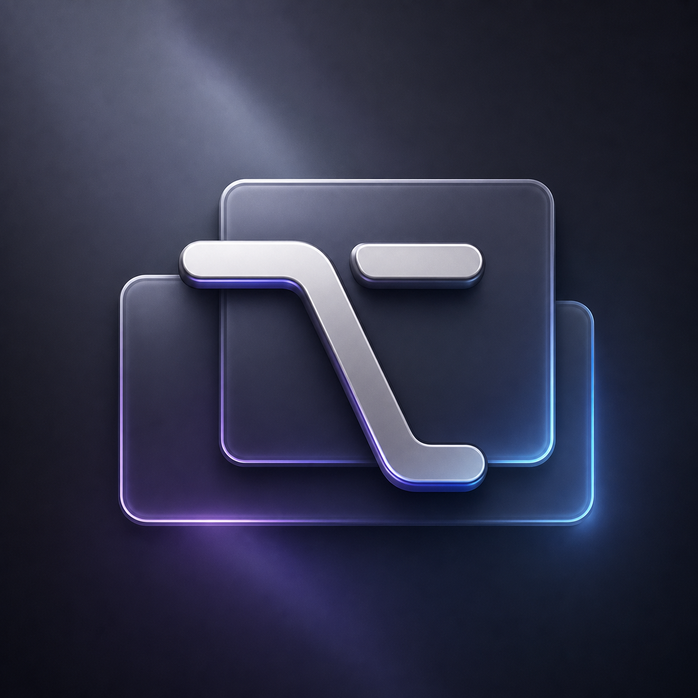

<p align="center">
  
</p>

<h1 align="center">快捷虾 · KeyHarbor</h1>

<p align="center">
  用全局快捷键，在 macOS 上快速切换 App。<br>
  Switch between macOS apps instantly with global keyboard shortcuts.
</p>

<p align="center">
  <a href="#中文">中文</a> · <a href="#english">English</a>
</p>

---

<a id="中文"></a>

## 中文

快捷虾是一款原生 macOS 菜单栏工具。它把常用 App 绑定到全局快捷键，让你无需寻找窗口、切换桌面或打开程序坞，按一次组合键即可打开或聚焦目标 App。

### 功能亮点

- **快速切换 App**：目标 App 未运行时自动打开，已运行时切换并聚焦窗口。
- **可视化快捷键设置**：在键盘界面中直接查看绑定，双击按键即可选择 App。
- **显示与返回桌面**：同一个快捷键显示桌面，再按一次返回之前的前台 App。
- **随时唤起面板**：面板快捷键不受“暂停切换”影响，方便随时恢复或调整设置。
- **菜单栏控制**：快速暂停全部 App 切换快捷键，暂停状态会在重启后保留。
- **开机启动**：默认尝试注册为 macOS 登录项。
- **原生轻量**：使用 Swift、SwiftUI 和 AppKit 构建。

### 默认快捷键

| 快捷键 | 操作 |
| --- | --- |
| `Option + W` | 打开或切换到 WeChat |
| `Option + C` | 打开或切换到 ChatGPT |
| `Option + E` | 打开或切换到邮件 |
| `Option + M` | 打开或切换到音乐 |
| `Option + B` | 打开或切换到 Google Chrome |
| `Option + Space` | 显示桌面；再次按下返回之前的 App |
| `Option + Shift + Z` | 打开快捷虾设置面板 |

### 自定义绑定

打开设置面板后，双击键盘上的任意可绑定按键，然后选择一个 App。已绑定按键会直接显示 App 图标；选中按键后，可以通过底部的清除按钮移除绑定。

以下快捷键为系统功能保留，不能绑定给其他 App：

- `Option + Space`：显示/返回桌面
- `Option + Shift + Z`：打开快捷虾面板

### 从源码安装

要求：macOS 13 或更高版本，以及 Xcode Command Line Tools。

```bash
git clone https://github.com/Smartin524/KeyHarbor.git
cd KeyHarbor
bash Scripts/install_app.sh
```

安装脚本会构建 App、复制到 `/Applications/快捷虾.app` 并启动。之后可从屏幕右上角菜单栏重新打开设置。

### 权限说明

首次切换 App 时，macOS 可能会请求“辅助功能”权限。授权后，快捷虾可以在切换桌面后将目标 App 的窗口抬到最前并聚焦。打开设置面板本身不依赖辅助功能权限。

如果系统要求确认开机启动，请前往“系统设置 → 通用 → 登录项”允许快捷虾。

### 开发与测试

```bash
# Debug 构建
swift build

# 轻量回归测试
bash Scripts/test.sh

# 打包本机可运行的 App
bash Scripts/package_app.sh
open dist/快捷虾.app
```

当前版本使用本机 ad-hoc 签名，尚未包含 App Store 发布、公证或正式 Developer ID 签名流程。

---

<a id="english"></a>

## English

KeyHarbor is a native macOS menu bar utility that binds frequently used apps to global keyboard shortcuts. Open or focus an app with one key combination—without hunting for windows, switching Spaces, or reaching for the Dock.

### Highlights

- **Instant app switching**: Launch an app when it is closed, or activate and focus it when it is already running.
- **Visual shortcut editor**: See bindings on a keyboard layout and double-click a key to select an app.
- **Desktop toggle**: Show the desktop and return to the previous foreground app with the same shortcut.
- **Always-available panel**: The panel shortcut remains active while app-switching shortcuts are paused.
- **Menu bar controls**: Pause all app-switching shortcuts; the paused state persists across restarts.
- **Launch at login**: Automatically attempts to register as a macOS login item.
- **Native and lightweight**: Built with Swift, SwiftUI, and AppKit.

### Default shortcuts

| Shortcut | Action |
| --- | --- |
| `Option + W` | Open or switch to WeChat |
| `Option + C` | Open or switch to ChatGPT |
| `Option + E` | Open or switch to Mail |
| `Option + M` | Open or switch to Music |
| `Option + B` | Open or switch to Google Chrome |
| `Option + Space` | Show the desktop; press again to return to the previous app |
| `Option + Shift + Z` | Open the KeyHarbor settings panel |

### Customize bindings

Open the settings panel, double-click any bindable key on the keyboard, and select an app. Bound keys display the app icon directly. Select a key and use the clear button at the bottom to remove its binding.

The following shortcuts are reserved and cannot be assigned to another app:

- `Option + Space`: Show/return from the desktop
- `Option + Shift + Z`: Open the KeyHarbor panel

### Install from source

Requirements: macOS 13 or later and Xcode Command Line Tools.

```bash
git clone https://github.com/Smartin524/KeyHarbor.git
cd KeyHarbor
bash Scripts/install_app.sh
```

The install script builds the app, copies it to `/Applications/快捷虾.app`, and launches it. You can reopen the settings panel from the menu bar at any time.

### Permissions

macOS may request Accessibility permission the first time KeyHarbor switches to an app. Once granted, KeyHarbor can raise and focus the target window after moving between Spaces. Opening the settings panel does not require Accessibility permission.

If macOS asks you to approve launch at login, enable KeyHarbor under **System Settings → General → Login Items**.

### Build and test

```bash
# Debug build
swift build

# Lightweight regression tests
bash Scripts/test.sh

# Package a locally runnable app
bash Scripts/package_app.sh
open dist/快捷虾.app
```

The current release uses a local ad-hoc signature. App Store distribution, notarization, and Developer ID signing are not included yet.
